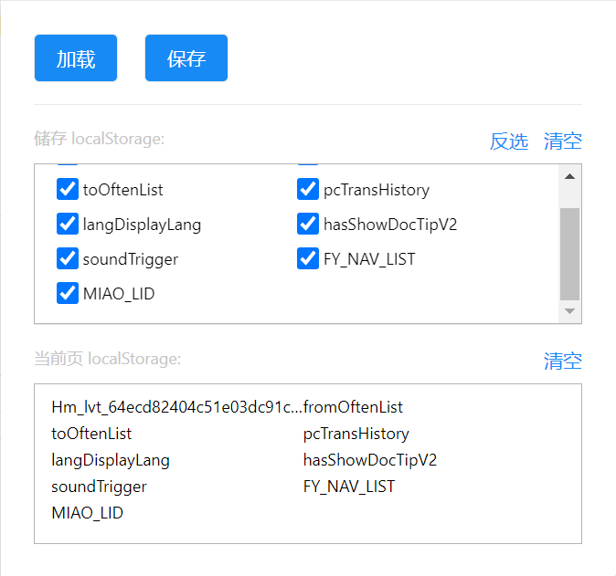

# chrome-storage-helper

帮助在不同的chrome页之间切换localStorage数据

## 如何安装
```js
1、打开 chrome浏览器 页面的 chrome extension 页面
2、打开开发者模式
3、将 chrome-storage-helper 文件夹拖进 chrome extension 页面即可
```

## 支持功能
```
1、保存当前页localStorage
2、加载存储localStorage到当前页
3、全选/反选 选择加载的项
4、tabs页之间同步选中状态
```
## 演示

<!--  -->